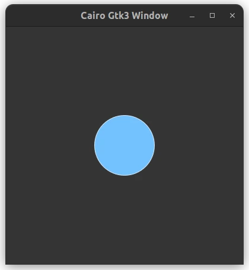

# cairo_gtk3_window

A gtk3 application using cairo to display a circle.



## Dependencies
* gcc (GNU GCC Compiler)
	* build-essential (Debian and Ubuntu distros and its derivatives)
* libgtk-3-dev
* libcairo2-dev 
* cmake

## Building the project
Set up the build directory
```
cmake -B build
```

Go to build directory
```
cd build
```

Compile the project
```
cmake --build .
```

## Resources
- [Basic drawing in Cairo](https://zetcode.com/gfx/cairo/basicdrawing/)

